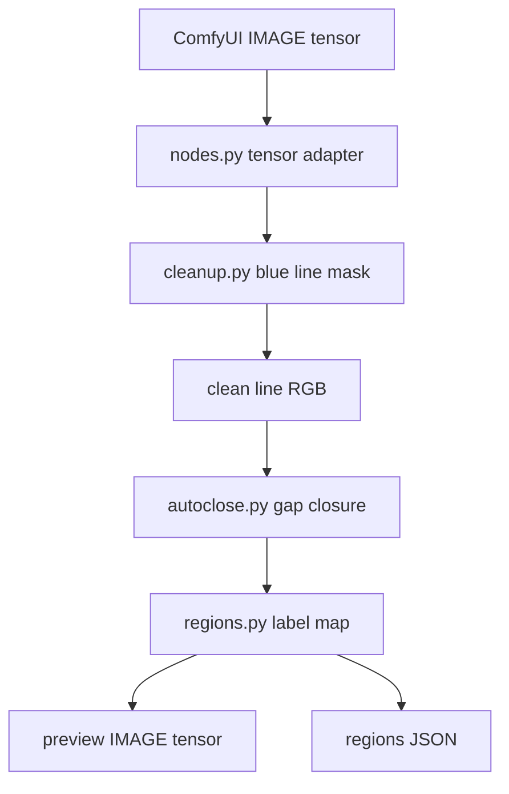
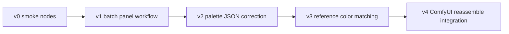

# 아키텍처

[English version](architecture.md)

이 프로젝트는 OpenToonz 아이디어를 가져온 작은 Python/ComfyUI line preparation
브릿지입니다. OpenToonz C++ 링크는 의도적으로 피합니다.

## 모듈 구조

```text
ComfyUI-OpenToonzLineTools/
  __init__.py                       ComfyUI custom-node 진입점
  opentoonz_line_tools/
    cleanup.py                      블루 러프 선 추출
    autoclose.py                    endpoint 기반 gap closing
    regions.py                      fillable region labeling
    nodes.py                        ComfyUI node class
  tests/
    test_line_tools.py              core algorithm smoke test
  docs/
    architecture.md / .ko.md
    visual_pipeline.md / .ko.md
```

## 설계 원칙

- core algorithm은 ComfyUI tensor에 의존하지 않게 둡니다.
- ComfyUI wrapper는 tensor 변환, parameter binding, JSON 출력만 담당합니다.
- C++ 직접 바인딩보다 Python/OpenCV 재구현을 우선합니다.
- 전처리 단계마다 시각 preview를 출력합니다.
- panel splitter pipeline에서 판단을 확인/재실행할 수 있도록 JSON artifact를 남깁니다.

## 데이터 흐름



## 구현 메모

### Cleanup

`cleanup.py`는 HSV 기반 블루 분류, morphology, connected-component despeckling을
사용합니다. OpenToonz cleanup/color-line processing 아이디어를 블루 러프 원고에
맞게 가볍게 재구성한 것입니다.

### AutoClose

`autoclose.py`는 작은 Zhang-Suen thinning 구현, endpoint detection, local
direction estimation, distance/angle filtering을 사용합니다. 핵심은 OpenToonz의
유용한 발상, 즉 paint/fill 전에 작은 gap을 닫는 것입니다.

### Region Map

`regions.py`는 line mask 밖의 fillable connected region을 labeling하고 간단한
palette-style metadata를 출력합니다. 아직 완전한 Toonz Raster palette-index format은
아니지만, 그쪽으로 가기 위한 데이터 경계를 만듭니다.

## 확장 계획



## 검증

현재 검증 명령:

```bash
/Users/iwongyeong/AI/ComfyUI/.venv/bin/python -m unittest discover -s tests -v
```

테스트 범위:

- 블루 선 추출과 despeckling,
- 작은 수평 gap closure,
- 닫힌 영역 labeling.
