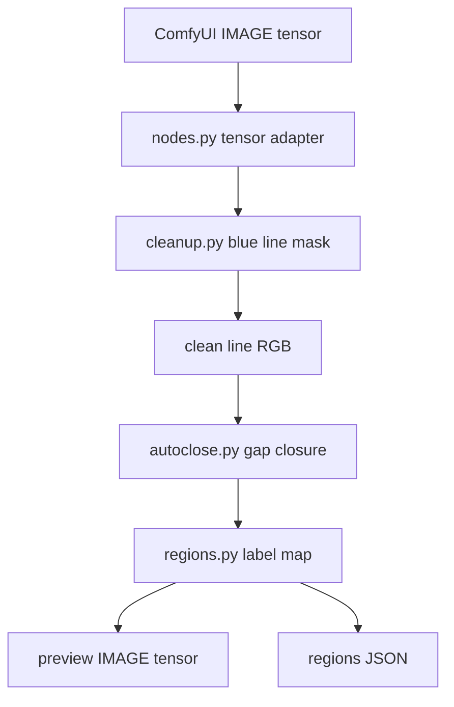
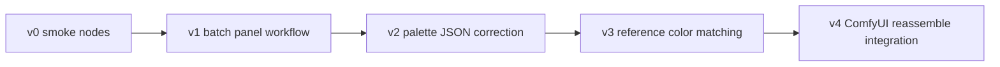

# Architecture

[한국어 버전](architecture.ko.md)

This project is a small Python/ComfyUI bridge for OpenToonz-inspired line
preparation. It intentionally avoids OpenToonz C++ linkage.

## Module Map

```text
ComfyUI-OpenToonzLineTools/
  __init__.py                       ComfyUI custom-node entrypoint
  opentoonz_line_tools/
    cleanup.py                      blue rough line extraction
    autoclose.py                    endpoint-based gap closing
    regions.py                      fillable region labeling
    nodes.py                        ComfyUI node classes
  tests/
    test_line_tools.py              smoke tests for core algorithms
  docs/
    architecture.md / .ko.md
    visual_pipeline.md / .ko.md
```

## Design Rules

- Keep core algorithms independent from ComfyUI tensors.
- Keep ComfyUI wrappers thin: tensor conversion, parameter binding, JSON output.
- Prefer Python/OpenCV reimplementation over direct C++ binding.
- Emit visual previews for every destructive-looking preprocessing step.
- Preserve JSON artifacts so the panel splitter pipeline can inspect or replay
  decisions.

## Data Flow



## Implementation Notes

### Cleanup

`cleanup.py` uses HSV blue classification plus morphology and connected-component
despeckling. This is the practical counterpart of OpenToonz cleanup/color-line
processing for blue rough manuscripts.

### AutoClose

`autoclose.py` uses a small Zhang-Suen thinning implementation, endpoint
detection, local direction estimation, and distance/angle filtering. This mirrors
the useful OpenToonz idea: close small gaps before paint/fill operations.

### Region Map

`regions.py` labels connected fillable regions outside the line mask and emits
simple palette-style metadata. It is not a full Toonz Raster palette-index format
yet, but it creates the data boundary needed for one.

## Extension Plan



## Verification

Current verification:

```bash
/Users/iwongyeong/AI/ComfyUI/.venv/bin/python -m unittest discover -s tests -v
```

The tests cover:

- blue line extraction with despeckling,
- small horizontal gap closure,
- closed-region labeling.
