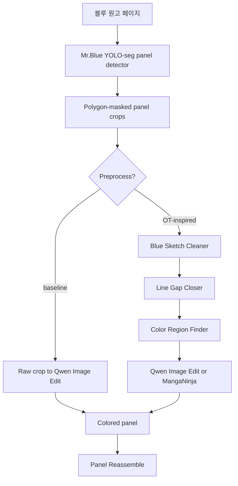
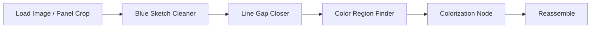
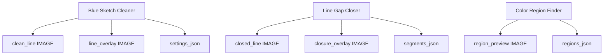

# 시각화 파이프라인

[English version](visual_pipeline.md)

이 문서는 OpenToonz 아이디어 기반 line tools가 현재 rough-sketch-to-color 연구
파이프라인의 어디에 들어가는지 보여줍니다.

## 연구 내 위치

## 노드 체인

## 출력 산출물

## 실험 매트릭스

| Variant | Color model 입력 | 기대 효과 | 위험 |
| --- | --- | --- | --- |
| A | raw panel crop | 가장 빠른 baseline | 블루 러프가 결과에 남을 수 있음 |
| B | clean line crop | blue noise 감소 | 의미 있는 러프 정보까지 제거할 수 있음 |
| C | clean line + autoclose | fill 안정성 증가 | 잘못된 closure line이 생길 수 있음 |
| D | clean line + autoclose + region JSON | 후처리 수정 용이 | downstream region-aware tooling 필요 |

## 채택 기준

아래 중 하나 이상이 명확히 좋아질 때 default 전처리로 채택합니다.

- 최종 결과의 blue artifact 감소,
- line boundary를 넘어가는 색 누수 감소,
- correction 이후 캐릭터/의상 색 일관성 향상,
- overlay/JSON으로 전처리 판단을 확인하기 쉬움.
