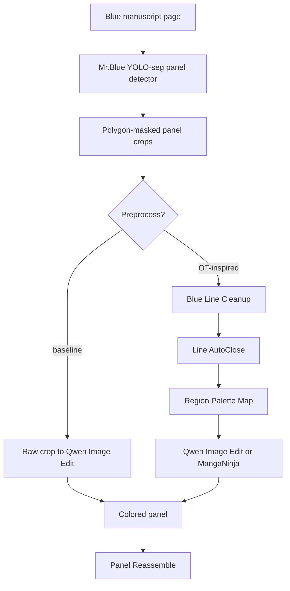
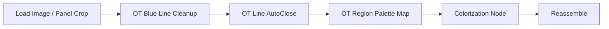
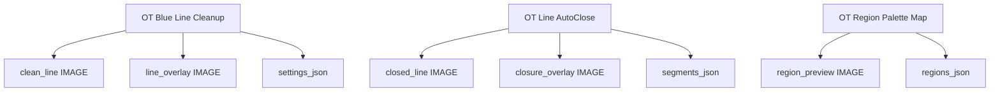

# Visual Pipeline

[한국어 버전](visual_pipeline.ko.md)

This document shows where the OpenToonz-inspired line tools fit in the current
rough-sketch-to-color research pipeline.

## Research Position

## Node Chain

## Output Artifacts

## Experiment Matrix

| Variant | Input to color model | Expected benefit | Risk |
| --- | --- | --- | --- |
| A | raw panel crop | fastest baseline | blue rough may leak into output |
| B | clean line crop | less blue noise | may remove useful semantic detail |
| C | clean line + autoclose | better fill stability | gap closure may create false lines |
| D | clean line + autoclose + region JSON | easier post-correction | needs downstream region-aware tooling |

## Adoption Gate

Use these tools as a default only if they improve at least one measurable outcome:

- fewer blue artifacts in final output,
- fewer color leaks across line boundaries,
- better character/costume color consistency after correction,
- easier manual review because overlays/JSON explain preprocessing choices.
